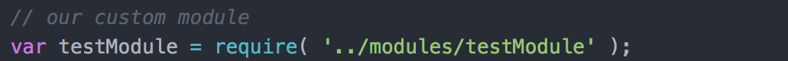
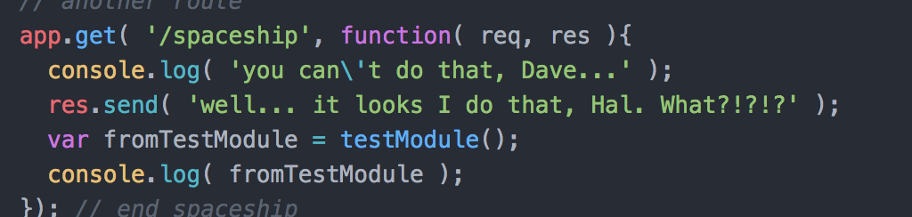
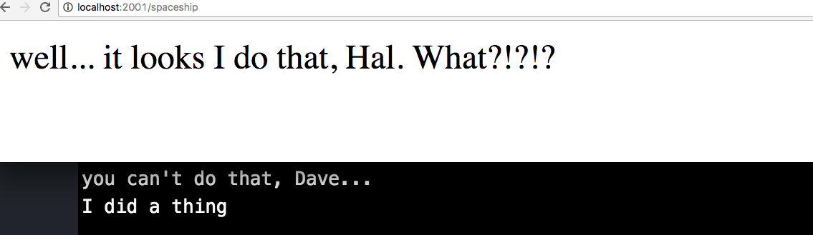
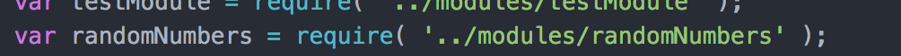
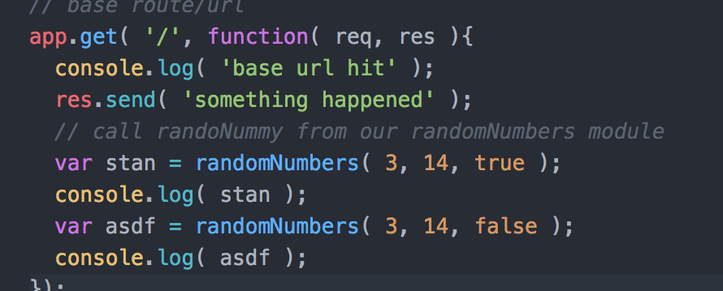
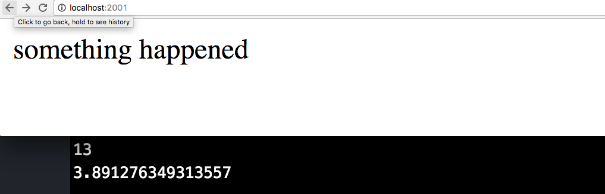

module basics
=============

testModule
----------

* create 'modules' folder in the project root
* create 'testModule.js' in 'modules' folder
* require 'testModule' in app.js

* run testModule's function when browser loads '/spaceship'

* load /spaceship in browser

randoNummy
----------
* create 'randomNumbers.js' in 'modules'
* add randoNummy function to 'randomNumbers.js'
* require 'randomNumbers' to app.js

* run randomNumbers on base url load

* load base url

